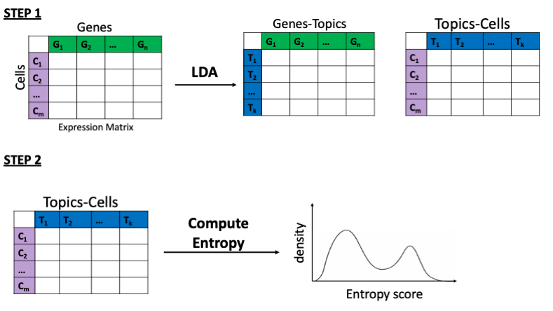

## Doublets Analysis
Code for reproducing the results of the LDA based approach for doublet detection. Banchmarking studies included.

### Datasets

* Demuxlet: The pre-processed dataset, originally available from the Demuxlet paper, is available on GEO under accession number GSE96583, GSM2560248. The dataset consists of peripheral blood mononuclear cells (PBMCs) from 8 donors. Only cells annotated as doublets and singlets are used for the analysis. Cells annotated as ambigious are not used. Cell annotations are available at https://github.com/yelabucsf/demuxlet_paper_code. 

* Cell Hashing PBMCS: A pre-processed dataset was downloaded from Seurat 3.1; FASTQ files and processed data are also available from GEO under accession number: GSE108313. Singlet or doublet labels, used as ground truth in the next sections, were obtained by using the HTODemux() function from Seurat v.3.1. The dataset consists of eight donors. Cells annotated as "negative" are not considered in the comperative analysis. 

* Cell Hashing Cell lines: A pre-processed dataset was downloaded from Seurat 3.1 and FASTQ files and processed data are also available from GEO under accession number: GSE108313.  Demultiplexing is based on the Seurat functionality, similarly to the Cell Hashing PBMCs. 

### Analysis with DoubletFinder and DoubletDecon

* DoubletFinder: Analysis performed in R 3.6.0. Installed from: https://github.com/chris-mcginnis-ucsf/DoubletFinder. The functions compatible with Seurat v3 were used, *paramSweep_v3* and *doubletFinder_v3*. The first 10 principal components were used with paramSweep_v3. The number of generated artificial doublets, *pN* was kept to default, 25%. The output of the parameter sweep was used to determine the neighbourhood for doublet scoring, *pK*. This value is dataset specific. To illustrate the effect of the doublet rate on the results, different values were used for the Demuxlet PBMCs: 8%, 10.9%, 11.5%, 12.5%. Further details: have a look at the R scripts for each dataset. 

* DoubletDecon: Analysis performed in R 3.6.0. Installed from: https://github.com/EDePasquale/DoubletDecon. The *MainDoubletDecon* functions was used for labelling the doublets. Species set to *hsa*. Clustering was peformed in Seurat. Different proportions of doublets were allowed to be set with the *only50* parameter set to *false*. Further details: have a look at the R scripts for each dataset. 

### LDA and entropy scoring 
We test a two-step based procedure. In Step 1, LDA is used to decompose the original expression matrix. Next, in Step 2 entropy per cell is computed based on the topic-cells distributions. An entropy cut-off is used to determine if cells are doublets or singlets. 

